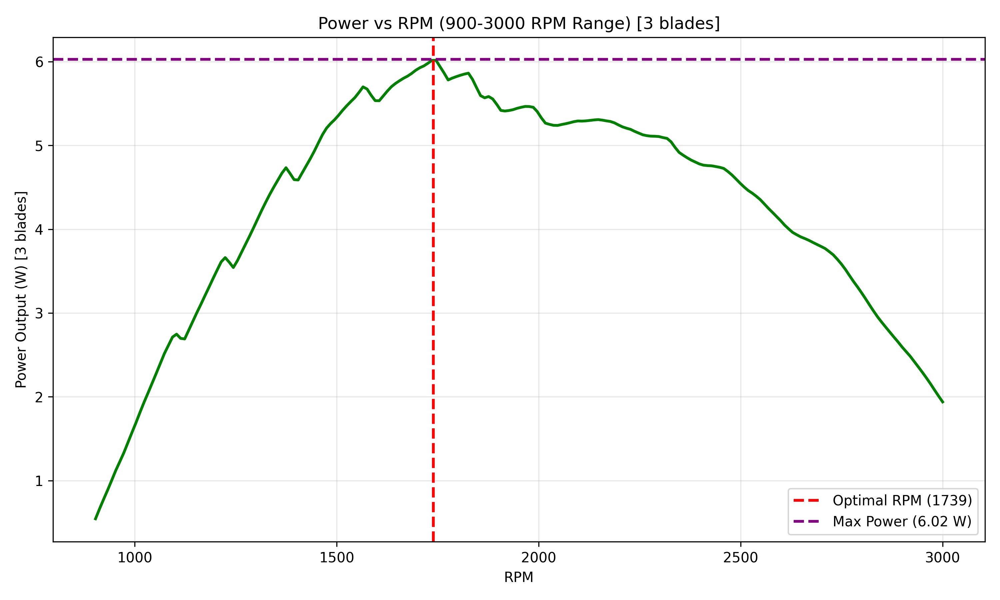
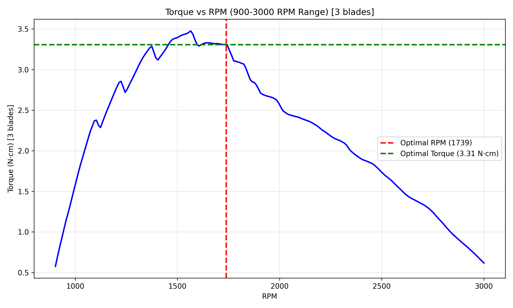

# MAE 4272 Wind Turbine Blade Optimization

Course design project optimizing blade pitch/twist and operating RPM to maximize expected power under a Weibull wind distribution, using **Viterna-Corrigan** extrapolation for accurate post-stall aerodynamics.

### Design Constraints
- Blade length: 6 inches (152.4 mm)
- Hub radius: 1 inch (25.4 mm)
- Max RPM: 2000
- Max stress: 29.33 MPa (1.5 safety factor)
- Airfoil: NACA 4412
- Wind: Weibull (k=5, c=5 m/s, mean ~4.5 m/s)

### Quick Start

```bash
# Full run (popsize=60, maxiter=2000 — 5–10 hours)
python src/run_full_analysis.py
```

```bash
# Quick test run (fast preview)
python src/windfoil_optimization_viterna.py --popsize 10 --maxiter 50
```

### Key Features

- **Viterna-Corrigan extrapolation** — industry-standard post-stall modeling
- **Weibull-weighted penalties** — rare high wind speeds contribute minimally → realistic optimization at design condition
- **Rotated moment of inertia** — accounts for pitch angle in stress analysis
- **Polynomial pitch smoothing** — manufacturing-ready parameters
- **Portable paths** — uses pathlib for clean, reproducible execution

### Results

Run the scripts to generate outputs in `outputs/viterna_corrigan/`.

**Sample plots from original submission:**


*Power vs RPM — full range*


*Torque vs RPM — full range*

### Post-Submission Improvements

- Replaced hardcoded paths with `pathlib.Path`-based relative paths
- Implemented probabilistic (Weibull PDF-weighted) constraint penalties
- Increased optimization fidelity (popsize=60, maxiter=2000)
- Clean project reorganization (src/, data/, outputs/, archive/, etc.)
- Archived original results with explanation

### Potential Future Work

- DE hyperparameter tuning (mutation, crossover, penalties)
- Advanced DE variants (jDE, SaDE, composite strategies)
- Cloud-parallel optimization runs
- Wind-tunnel validation of polars and performance
- 3D effects (tip losses, hub friction, torsion)

### Dependencies

```bash
pip install -r requirements.txt
```

(numpy, scipy, pandas, matplotlib)

### License

MIT — see LICENSE file